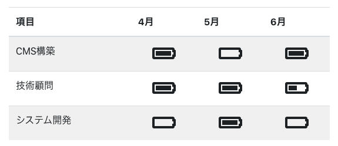

# work-availability

お仕事やリソース状況をリスト出力するReactコンポーネント。
[HAMWORKS](https://twitter.com/hamworks/status/1377425482023571460?s=20) さんのリソース状況をインスパイアして、作成しました。


[](https://www.npmjs.com/package/work-availability) [](https://standardjs.com)

## インストール

npm
```bash
npm install --save work-availability
```

yarn
```bash
yarn add work-availability
```

## 使い方

```tsx
import React, { Component } from 'react'

import { WorkAvailability, Row } from 'work-availability'
import 'work-availability/dist/index.css'

const headers:Array<string> = [
  '項目',
  '4月',
  '5月',
  '6月'
]
const data:Array<Row> = [
  {title: "CMS構築", availabilities: ['full', 'empty', 'full']},
  {title: "技術顧問", availabilities: ['full', 'full', 'half']},
  {title: "システム開発", availabilities: ['empty', 'full', 'empty']}
]

class Example extends Component {
  render() {
    return (
      <WorkAvailability headers={headers} data={data}
                        type='icon' className='table table-striped w-50 mb-3' />
    )
  }
}
```

### 出力結果


## 各パラメーターについて
### headers
配列。各列のヘッダー。

### data
データ。各行のデータ。titleに作業名や氏名を、availabilitiesに各列の状況を記入。ステータスは以下の通り

| ステータス | 内容 |
| --- | --- |
| full | ◯。満タン |
| half | △。半分程度 |
| empty | ×。空 |

### type
ステータスの表示タイプ。タイプは以下の通り。

| タイプ | 内容 |
| --- | --- |
| icon | アイコン。バッテリーアイコンで表示。デフォルト |
| text | 文字列やHTML。HTMLの場合はavailabilitiesにElementを指定 |
| image | 画像。availabilitiesに画像パスを指定 |

### className
CSSクラス名。CSSを指定する場合に利用

### id
id。ID指定が必要な場合に利用

## License

MIT © [Ippey](https://github.com/Ippey)
